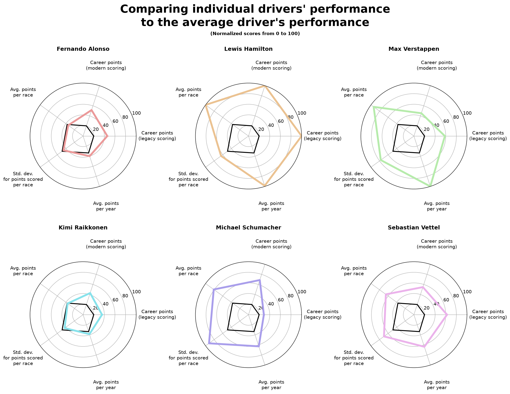

# dbt version of my F1 Ergast SQL Project
[Read the readme here for more info on the overall project.](https://github.com/Cazuchi/Transforming-TourMIS-data-into-a-performance-dashboard)

This project uses the same dataset and the same queries, except they've been modified to follow the pattern of a dbt database. To show that it's working and outputs correct data, [I've included a notebook with inline visualization to show the output of the project.](https://github.com/Cazuchi/dbt-F1-ergast-data-SQL-project/blob/main/analysis.ipynb). Since it's just a proof of functionality, I've just created a simple array of spider charts, comparing 6 select drivers performance on chosen metrics to the average driver, which resulted in this plot:  
  

### Skills used in this project:
* PostgreSQL
* dbt
* Docker
* Python